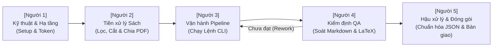

# BẢNG CÔNG VIỆC DÀNH CHO ĐỘI NGŨ 5 NGƯỜI (5-PERSON TEAM TO-DO LIST)
## Quy Trình Phối Hợp Số Hóa & Trích Xuất Sách Qua MinerU Pipeline

Bảng phân công nhiệm vụ chi tiết, công cụ cần dùng và tiêu chuẩn hoàn thành cho từng vị trí trong **đội ngũ 5 người** để vận hành dây chuyền số hóa sách từ PDF sang **Markdown (.md)**, **JSON cấu trúc** và **Hình ảnh**.

---

## SƠ ĐỒ PHỐI HỢP DÂY CHUYỀN (HAND-OFF WORKFLOW)



---

## 🧑‍💻 NGƯỜI 1: KỸ THUẬT VIÊN HẠ TẦNG & MÔI TRƯỜNG (INFRA & DEVOPS)
> **Mục tiêu:** Đảm bảo hệ thống máy tính, mã nguồn, API Token và mạng hoạt động thông suốt 100% cho cả đội.

### 🛠️ Công cụ cần dùng:
- Máy tính cài Python 3.10+, PowerShell/Git Bash.
- Tài khoản quản trị trang [mineru.net](https://mineru.net/apiManage/docs).
- File cấu hình: `.env`, `test_connection.py`, `requirements.txt`.

### 📋 Checklist công việc:
- [ ] **1. Cài đặt và cập nhật môi trường**:
  - [ ] Cài đặt các thư viện cần thiết: `pip install -r requirements.txt`.
  - [ ] Đảm bảo mã nguồn mới nhất (`mineru_client.py`, `run_pipeline.py`).
- [ ] **2. Quản lý API Token & Hạn mức (Quota)**:
  - [ ] Đăng nhập [https://mineru.net/apiManage/docs](https://mineru.net/apiManage/docs), lấy API Bearer Token.
  - [ ] Kiểm tra số dư tài khoản/lượt gọi API hàng ngày còn đủ cho kế hoạch trích xuất.
  - [ ] Cấu hình chuỗi Token vào file `.env`: `MINERU_API_TOKEN=...`.
- [ ] **3. Kiểm tra kết nối mạng quốc tế**:
  - [ ] Chạy lệnh chẩn đoán:
    ```powershell
    python test_connection.py
    ```
  - [ ] Đảm bảo cơ chế tăng tốc quốc tế `oss-accelerate` hoạt động, không bị lỗi reset mạng `WinError 10054`.
- [ ] **4. Hỗ trợ kỹ thuật**:
  - [ ] Xử lý sự cố mạng, xung đột thư viện hoặc lỗi phân quyền khi các thành viên khác báo cáo.

> **✅ ĐẠT YÊU CẦU HOÀN THÀNH:** Chạy lệnh `python test_connection.py` báo `[+] Xác thực Token THÀNH CÔNG!` và bàn giao hệ thống sẵn sàng cho Người 2 & Người 3.

---

## 📑 NGƯỜI 2: TIẾP NHẬN & TIỀN XỬ LÝ SÁCH GỐC (DATA PREPARATION)
> **Mục tiêu:** Thu thập, kiểm tra, làm sạch và chuẩn hóa file PDF đầu vào đúng chuẩn kỹ thuật của MinerU.

### 🛠️ Công cụ cần dùng:
- Thư mục nguồn chứa sách gốc.
- Phần mềm đọc & chỉnh sửa PDF (Adobe Acrobat, Foxit PDF, PDF24 Creator hoặc công cụ online ilovepdf.com).
- Thư mục tiếp nhận: `sample/` hoặc thư mục sách đầu vào.

### 📋 Checklist công việc:
- [ ] **1. Tiếp nhận và phân loại sách**:
  - [ ] Xác định thể loại sách: Sách điện tử sinh từ Word (text chọn được) hay Sách scan chụp ảnh.
  - [ ] Xác định ngôn ngữ chính của sách: Tiếng Việt, Tiếng Anh (`en`), hay Tiếng Trung/đa ngữ (`ch`).
- [ ] **2. Kiểm tra giới hạn kỹ thuật của MinerU Cloud**:
  - [ ] **Dung lượng**: Nếu file $> 200\text{ MB}$, dùng công cụ nén PDF xuống dưới 200MB.
  - [ ] **Số trang**: Nếu sách $> 200$ trang, dùng công cụ cắt PDF (Split PDF) thành từng phần:
    - *Ví dụ:* Cuốn 450 trang $\rightarrow$ Chia thành: `Sach_Part1.pdf` (trang 1-180), `Sach_Part2.pdf` (trang 181-350), `Sach_Part3.pdf` (trang 351-450).
- [ ] **3. Chuẩn hóa tên file**:
  - [ ] Đổi tên file gọn gàng, rõ nghĩa, không chứa ký tự cấm hệ điều hành (khuyên dùng định dạng: `Ten_Sach_Tac_Gia.pdf`).
- [ ] **4. Bàn giao file sẵn sàng**:
  - [ ] Copy các file đã xử lý chuẩn vào thư mục `sample/`.
  - [ ] Bàn giao danh sách file kèm ghi chú cấu hình (sách nào cần bật `--ocr`, ngôn ngữ gì) cho Người 3.

> **✅ ĐẠT YÊU CẦU HOÀN THÀNH:** 100% file sách trong thư mục chờ xử lý đều $\le 200$ trang, $\le 200$ MB, hiển thị rõ trang và có phiếu ghi chú tham số cho Người 3.

---

## ⚙️ NGƯỜI 3: ĐIỀU PHỐI & THỰC THI PIPELINE (PIPELINE OPERATOR)
> **Mục tiêu:** Nhận file từ Người 2, chạy đúng lệnh, theo dõi hoàn tất và giải nén toàn bộ kết quả vào thư mục `output/`.

### 🛠️ Công cụ cần dùng:
- Terminal / PowerShell tại thư mục `sexbook/`.
- Script thực thi: [`run_pipeline.py`](file:///c:/Users/Mori/Documents/Codex_sex_file/sexbook/run_pipeline.py).
- Thư mục đầu ra: `output/`.

### 📋 Checklist công việc:
- [ ] **1. Nhận thông tin từ Người 2**:
  - [ ] Xem danh sách file sách và ghi chú tham số (có cần `--ocr` không, ngôn ngữ `--lang` nào).
- [ ] **2. Chạy lệnh trích xuất**:
  - *Nếu là sách thông thường:*
    ```powershell
    python run_pipeline.py --file "sample\Ten_Sach.pdf"
    ```
  - *Nếu là sách scan/chữ mờ hoặc tiếng Anh (theo chỉ định của Người 2):*
    ```powershell
    python run_pipeline.py --file "sample\Ten_Sach.pdf" --ocr --lang en
    ```
- [ ] **3. Theo dõi tiến trình thời gian thực**:
  - [ ] Kiểm tra bước upload OSS Accelerate thành công (không bị ngắt kết nối).
  - [ ] Đợi trạng thái từ `WAITING-FILE` $\rightarrow$ `PROCESSING` $\rightarrow$ `DONE`.
  - [ ] Đảm bảo màn hình hiển thị: `[v] Pipeline hoàn thành thành công!`.
- [ ] **4. Kiểm tra sơ bộ gói kết quả**:
  - [ ] Xác nhận thư mục `output/<Tên_Sach>/` đã được tạo.
  - [ ] Kiểm tra có đủ file `full.md`, các file `.json` và thư mục `images/`.
  - [ ] Bàn giao đường dẫn thư mục `output/<Tên_Sach>/` cho Người 4 (Kiểm định QA).

> **✅ ĐẠT YÊU CẦU HOÀN THÀNH:** Toàn bộ danh sách sách đã chạy xong với Exit code 0, thư mục `output/<Tên_Sach>/` có đầy đủ các file theo quy định và bàn giao cho Người 4.

---

## 🔍 NGƯỜI 4: KIỂM ĐỊNH CHẤT LƯỢNG NỘI DUNG (QA / REVIEWER)
> **Mục tiêu:** Mở file Markdown kết quả và đối chiếu trực tiếp với file PDF gốc để phát hiện sai sót, lệch bảng, hỏng công thức hoặc mất chữ.

### 🛠️ Công cụ cần dùng:
- VS Code (với Markdown Preview Enhanced / KaTeX Preview).
- Phần mềm đọc PDF (mở song song màn hình: 1 bên PDF gốc, 1 bên file `full.md`).

### 📋 Checklist công việc:
- [ ] **1. Kiểm tra văn bản tiếng Việt & font chữ**:
  - [ ] Đọc lướt các chương: Tiếng Việt hiển thị đúng dấu UTF-8, không bị lỗi ô vuông `□` hoặc dấu `?`.
  - [ ] Kiểm tra không bị mất đoạn, đứt chữ ở vị trí giáp ranh giữa các trang.
- [ ] **2. Kiểm tra phân cấp đề mục (Headings)**:
  - [ ] Tiêu đề sách, tên chương `# Chương 1`, tên mục `## Mục 1.1` phân cấp đúng thứ bậc.
- [ ] **3. Kiểm tra công thức toán học / hóa học (LaTeX)**:
  - [ ] Các công thức phức tạp (phân số, tích phân, ma trận, ký tự Hy Lạp $\alpha, \beta, \pi$) nằm đúng trong `$ ... $` hoặc `$$ ... $$`.
  - [ ] Bật chế độ Preview Markdown xem công thức có render đẹp và chính xác không.
- [ ] **4. Kiểm tra bảng biểu (Tables)**:
  - [ ] Dữ liệu trong bảng không bị dính chùm; các cột và hàng thẳng hàng dạng Markdown table.
  - [ ] Tiêu đề bảng và số liệu trong từng ô khớp với PDF gốc.
- [ ] **5. Kiểm tra hình ảnh (Images)**:
  - [ ] Các thẻ ảnh `` trong file `.md` hiển thị đúng ảnh trong thư mục `images/`.
  - [ ] Hình ảnh cắt ra rõ nét, không bị méo hoặc mất nửa hình.
- [ ] **6. Ra quyết định nghiệm thu**:
  - [ ] **ĐẠT (PASS)**: Ký duyệt biên bản nghiệm thu nội dung, chuyển giao cho Người 5.
  - [ ] **CHƯA ĐẠT (REWORK)**: Ghi chú lỗi cụ thể (ví dụ: "Thiếu chữ ở trang 15, bảng trang 20 bị lệch") $\rightarrow$ Yêu cầu Người 3 chạy lại kèm tham số `--ocr` hoặc báo Người 2 tiền xử lý lại.

> **✅ ĐẠT YÊU CẦU HOÀN THÀNH:** 100% các tiêu chí QA về chữ, toán, bảng, ảnh đều khớp $\ge 95\%$ so với sách gốc và có xác nhận PASS chuyển Người 5.

---

## 📦 NGƯỜI 5: HẬU XỬ LÝ DỮ LIỆU & ĐÓNG GÓI BÀN GIAO (DATA ENGINEER / DELIVERY)
> **Mục tiêu:** Chuẩn hóa dữ liệu JSON, đóng gói kho lưu trữ sạch và bàn giao vào cơ sở dữ liệu / hệ sinh thái AI (RAG, LLM, Vector Database).

### 🛠️ Công cụ cần dùng:
- VS Code, Python script hậu xử lý (nếu có).
- Công cụ kiểm tra JSON (JSON Formatter / Validator).
- Kho lưu trữ chung (Google Drive, NAS, S3, hoặc Git Repository).

### 📋 Checklist công việc:
- [ ] **1. Kiểm tra tính toàn vẹn của tệp JSON**:
  - [ ] Mở file `content_list.json`: Đảm bảo là định dạng JSON chuẩn (valid JSON, không lỗi cú pháp dấu phẩy, ngoặc).
  - [ ] Kiểm tra mảng danh sách khối: Có đầy đủ các loại phần tử `type`: `"text"`, `"title"`, `"table"`, `"equation"`, `"image"`.
  - [ ] Kiểm tra file tọa độ `layout.json` và `model.json` đầy đủ dung lượng.
- [ ] **2. Làm sạch & Chuẩn hóa định dạng (Post-processing)**:
  - [ ] Dọn dẹp các ký tự trắng thừa hoặc dòng trống liên tiếp trong file `full.md`.
  - [ ] Nếu cuốn sách được chia làm nhiều phần từ Người 2 (Part 1, Part 2...), thực hiện ghép nối các file Markdown và JSON theo đúng thứ tự nếu dự án yêu cầu 1 file duy nhất.
- [ ] **3. Đóng gói thư mục chuẩn sản phẩm**:
  - Cấu trúc bàn giao chuẩn:
    ```text
    RELEASE_<Tên_Sach>/
    ├── README_METADATA.txt     <-- Thông tin: Tên sách, Tác giả, Ngày số hóa, Tổng trang
    ├── sach_hoan_chinh.md      <-- Bản Markdown chuẩn sau QA
    ├── content_list.json       <-- Dữ liệu JSON cho AI / RAG
    ├── layout.json             <-- Tọa độ phục vụ highlight văn bản gốc
    ├── images/                 <-- Thư mục ảnh đã nén dung lượng tối ưu
    └── raw_result.zip          <-- Bản sao lưu gốc từ MinerU
    ```
- [ ] **4. Tải lên kho lưu trữ & Báo cáo hoàn tất**:
  - [ ] Upload gói hoàn chỉnh lên hệ thống lưu trữ chung của công ty/nhóm.
  - [ ] Cập nhật bảng tính tiến độ dự án: Đánh dấu cuốn sách đã hoàn thành `[DONE]`.

> **✅ ĐẠT YÊU CẦU HOÀN THÀNH:** Dữ liệu hoàn chỉnh được nạp thành công vào kho lưu trữ chung, file JSON hợp lệ 100%, sẵn sàng đưa vào ứng dụng thực tế.

---

## 📊 BẢNG TỔNG HỢP TRÁCH NHIỆM 5 NGƯỜI (RACI MATRIX)

| Giai đoạn | Người 1 (Infra) | Người 2 (Tiền xử lý) | Người 3 (Vận hành) | Người 4 (QA) | Người 5 (Đóng gói) |
| :--- | :---: | :---: | :---: | :---: | :---: |
| **1. Cài đặt môi trường & Token** | **R / A** (Chính) | I (Biết) | C (Phối hợp) | I | I |
| **2. Tiếp nhận, cắt & lọc PDF** | C (Hỗ trợ) | **R / A** (Chính) | C (Nhận file) | I | I |
| **3. Chạy lệnh Pipeline CLI** | C (Fix lỗi) | C (Bàn giao) | **R / A** (Chính) | I | I |
| **4. Soát Markdown, Toán, Bảng** | I | I | C (Rework) | **R / A** (Chính) | I |
| **5. Chuẩn hóa JSON & Lưu kho** | I | I | I | C (Nghiệm thu) | **R / A** (Chính) |

*(Ghi chú: **R** = Người trực tiếp làm; **A** = Người chịu trách nhiệm kết quả; **C** = Người phối hợp; **I** = Người nhận thông tin bàn giao)*
