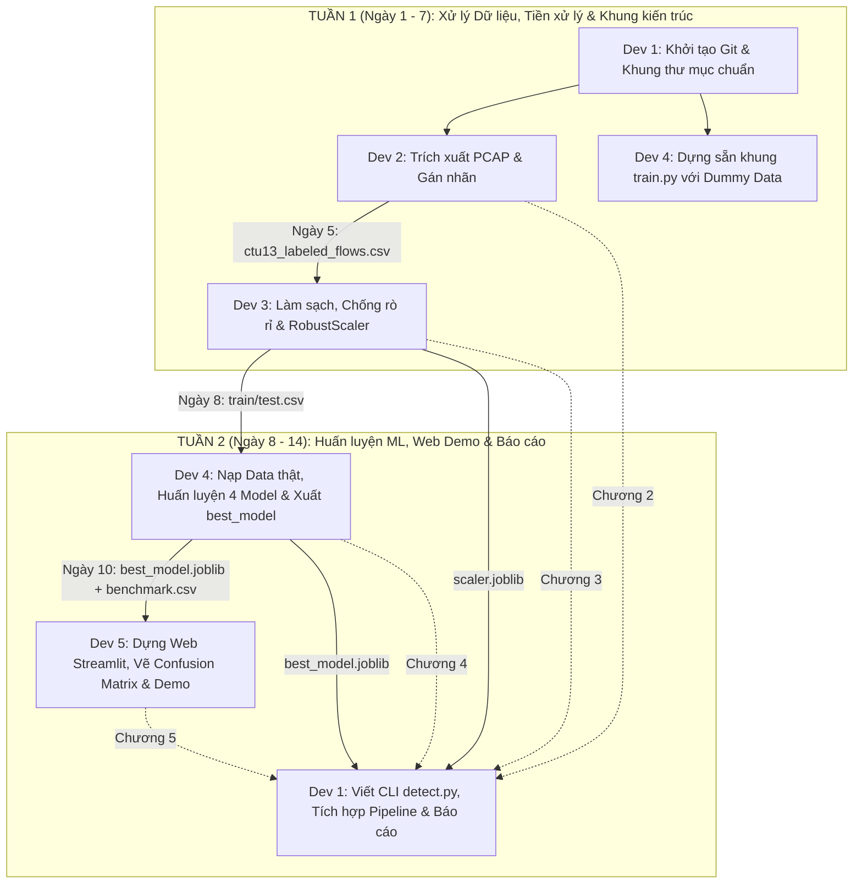

# BẢNG PHÂN CÔNG NHIỆM VỤ & TO-DO LIST CHI TIẾT (5 THÀNH VIÊN)

> **Dự án**: Xây dựng Pipeline trích xuất đặc trưng và phát hiện Botnet từ lưu lượng mạng PCAP  
> **Môn học**: Ứng dụng Học máy trong An toàn thông tin  
> **Thời gian thực hiện**: 2 tuần (Kế hoạch chạy nước rút - 14 ngày)  

---

## 🗺️ 1. Sơ đồ Dòng Chảy Dự Án (Tiến Độ 2 Tuần Nước Rút)



---

## 📂 2. Cấu Trúc Thư Mục Dự Án Chuẩn

```text
Botnet_sexline/
├── data/
│   ├── raw/                 <- Dev 2 lưu file PCAP mẫu
│   └── processed/           <- Chứa ctu13_labeled_flows.csv, train.csv, test.csv
├── models/                  <- Chứa scaler.joblib (Dev 3), best_model.joblib (Dev 4)
├── notebooks/               <- Dev 3 thực hiện phân tích 01_eda.ipynb
├── results/                 <- Dev 4 & Dev 5 lưu bảng điểm CSV và biểu đồ PNG
├── src/
│   ├── data/                <- Dev 2: flow_extractor.py, labeling.py
│   ├── features/            <- Dev 3: preprocessor.py
│   ├── models/              <- Dev 4: train.py
│   └── inference/           <- Dev 1: detect.py
├── scripts/                 <- Dev 1: run_pipeline.py
├── app.py                   <- Dev 5: Web Demo Streamlit
├── requirements.txt         <- Quản lý danh sách thư viện chung
├── README.md
└── TODO_LIST.md
```

---

## 📋 3. BẢNG NHIỆM VỤ CHI TIẾT TỪNG THÀNH VIÊN (DEV 1 - DEV 5)

---

### 👤 DEV 1: Leader & Tích Hợp Hệ Thống (System Architect & Integration)
* **Vai trò**: Quản trị Git, kết nối các module, viết CLI suy diễn, điều phối tiến độ 14 ngày, chủ trì biên soạn Báo cáo và Slide.
* **🛠 Công cụ sử dụng**: Git & GitHub, VS Code, Python 3.10+, `argparse`, Microsoft Word / Docs, PowerPoint / Canva.
* **📥 Điều kiện đầu vào**: Tài khoản GitHub của 5 thành viên; bộ mã nguồn từ Dev 2, 3, 4, 5 khi tích hợp.

* **💻 To-do List (Tiến độ 14 ngày):**
  - [ ] **Ngày 1**: Khởi tạo Git repo, tạo cây thư mục chuẩn, cấu hình `.gitignore` và `requirements.txt`.
  - [ ] **Ngày 2 - 7**: Theo dõi sát sao tiến độ bàn giao data giữa Dev 2 và Dev 3; soạn sẵn khung dàn ý Báo cáo (Word) và mẫu Slide thuyết trình.
  - [ ] **Ngày 8 - 10**: Lập trình script CLI `src/inference/detect.py`:
    - Nhận tham số file PCAP: `python src/inference/detect.py --pcap test.pcap`.
    - Kết nối: Bóc tách luồng (Dev 2) $\rightarrow$ Chuẩn hóa (Dev 3) $\rightarrow$ Dự đoán nhãn Botnet (Dev 4).
    - In ra danh sách các địa chỉ IP bị nghi vấn xâm nhập trên terminal.
  - [ ] **Ngày 11 - 12**: Lập trình script điều phối tự động `scripts/run_pipeline.py`.
  - [ ] **Ngày 12 - 14**: Thu thập nội dung Chương 2, 3, 4, 5 từ các bạn, ráp lại thành Báo cáo tổng thể hoàn chỉnh và hoàn thiện Slide thuyết trình.

* **🎯 Sản phẩm bàn giao:**
  - [ ] Repository Git chỉn chu, nhánh `main` ổn định.
  - [ ] Script `detect.py` và `run_pipeline.py` vận hành mượt mà.
  - [ ] File Báo cáo `.docx` và Slide thuyết trình `.pptx` hoàn chỉnh trước ngày 14.

---

### 👤 DEV 2: Kỹ Sư Dữ Liệu Mạng (PCAP Processing & Labeling)
* **Vai trò**: Trích xuất các đặc trưng thống kê từ file lưu lượng mạng thô (PCAP) và gán nhãn theo kịch bản CTU-13.
* **🛠 Công cụ sử dụng**: Python 3.10+, `scapy` / `pyshark`, `pandas`, `numpy`, Wireshark, dataset CTU-13.
* **📥 Điều kiện đầu vào**: Dev 1 hoàn thành Git repo; tải được file PCAP mẫu (~50-100MB) và danh sách IP Botnet.

* **💻 To-do List (Tiến độ 14 ngày):**
  - [ ] **Ngày 1 - 2**: Tải file PCAP mẫu và lưu vào `data/raw/`.
  - [ ] **Ngày 3 - 4**: Xây dựng module `src/data/flow_extractor.py`:
    - Gom nhóm gói tin thành Flow theo 5-tuple: `(src_ip, dst_ip, src_port, dst_port, protocol)`.
    - Tính toán các chỉ số: thời lượng luồng, số gói tin, tổng số byte, tốc độ truyền, độ dài gói tin trung bình.
  - [ ] **Ngày 4 - 5**: Xây dựng module `src/data/labeling.py`:
    - So khớp IP với danh sách Botnet IP từ CTU-13: Nếu trùng $\rightarrow$ `label = 1`, ngược lại $\rightarrow$ `label = 0`.
  - [ ] **Ngày 5**: Xuất file `data/processed/ctu13_labeled_flows.csv` **bàn giao ngay cho Dev 3**.
  - [ ] **Ngày 6 - 8**: Soạn thảo nội dung Chương 2 Báo cáo (Tổng quan dữ liệu CTU-13 và phương pháp trích xuất đặc trưng luồng mạng) nộp cho Dev 1.

* **🎯 Sản phẩm bàn giao:**
  - [ ] Module `flow_extractor.py` và `labeling.py`.
  - [ ] File dữ liệu `ctu13_labeled_flows.csv` (đầy đủ 2 nhãn, từ 20.000 - 100.000 dòng).
  - [ ] Bản thảo Chương 2 gửi Leader.

---

### 👤 DEV 3: Chuyên Viên Tiền Xử Lý & Chống Rò Rỉ Dữ Liệu (EDA, Preprocessing & Anti-Leakage)
* **Vai trò**: Khảo sát dữ liệu, xử lý ngoại lai/khuyết thiếu, xóa bỏ rò rỉ dữ liệu (Anti-Leakage), chuẩn hóa thang đo và chia tập Train/Test.
* **🛠 Công cụ sử dụng**: Jupyter Notebook, `pandas`, `numpy`, `matplotlib`, `seaborn`, `scikit-learn` (`RobustScaler`, `train_test_split`), `joblib` / `pickle`.
* **📥 Điều kiện đầu vào**: Nhận file `ctu13_labeled_flows.csv` từ Dev 2 vào Ngày 5.

* **💻 To-do List (Tiến độ 14 ngày):**
  - [ ] **Ngày 3 - 4**: Tạo sẵn khung Jupyter Notebook `notebooks/01_eda.ipynb` (chuẩn bị sẵn các hàm vẽ phân bố nhãn, thống kê missing value).
  - [ ] **Ngày 5 - 6**: Nhận data từ Dev 2, chạy EDA khảo sát tỷ lệ mất cân bằng dữ liệu và các giá trị lỗi.
  - [ ] **Ngày 6 - 7**: Xây dựng module `src/features/preprocessor.py`:
    - Xử lý giá trị vô cùng (`Inf` $\rightarrow$ `NaN`), điền khuyết thiếu bằng trung vị (Median).
    - **CHỐNG RÒ RỈ DỮ LIỆU**: Xóa bỏ hoàn toàn các cột định danh (`src_ip`, `dst_ip`, `src_port`, `dst_port`, `timestamp`).
    - Phân chia tập Train/Test: 70% Train - 30% Test (`stratify=y`, `random_state=42`).
    - Dùng `RobustScaler` fit trên tập Train, transform cho cả Train và Test.
    - Lưu bộ chuẩn hóa vào `models/scaler.joblib`.
  - [ ] **Ngày 8**: Xuất `train_data.csv`, `test_data.csv` **bàn giao ngay cho Dev 4**.
  - [ ] **Ngày 9 - 11**: Soạn thảo nội dung Chương 3 Báo cáo (Kỹ thuật tiền xử lý, cơ sở dùng RobustScaler và phân tích chống Data Leakage) nộp cho Dev 1.

* **🎯 Sản phẩm bàn giao:**
  - [ ] Notebook `01_eda.ipynb` hoàn thiện trực quan.
  - [ ] Module `preprocessor.py` chạy độc lập.
  - [ ] 2 file dữ liệu sạch: `train_data.csv`, `test_data.csv` và file `scaler.joblib`.
  - [ ] Bản thảo Chương 3 gửi Leader.

---

### 👤 DEV 4: Kỹ Sư Machine Learning (Core ML Models & Evaluation)
* **Vai trò**: Huấn luyện các mô hình ML, đo lường các chỉ số an ninh mạng (Accuracy, Precision, Recall, F1, FPR) và đóng gói mô hình xuất sắc nhất.
* **🛠 Công cụ sử dụng**: Python 3.10+, `scikit-learn`, `pickle` / `joblib`, `pandas`.
* **📥 Điều kiện đầu vào**: Nhận `train_data.csv` và `test_data.csv` từ Dev 3 vào Ngày 8.

* **💻 To-do List (Tiến độ 14 ngày):**
  - [ ] **Ngày 1 - 4**: Dựng sẵn toàn bộ khung code huấn luyện `src/models/train.py` (với dữ liệu giả lập), kiểm tra chạy mượt mà không lỗi cú pháp.
  - [ ] **Ngày 5 - 7**: Viết trước phần lý thuyết Chương 4 Báo cáo (Lý thuyết về Logistic Regression, Decision Tree, Random Forest, MLP và ý nghĩa chỉ số FPR trong An toàn thông tin).
  - [ ] **Ngày 8 - 9**: Nhận dữ liệu sạch từ Dev 3, chạy `python src/models/train.py` trên dữ liệu thật:
    - Huấn luyện 4 mô hình: Logistic Regression, Decision Tree, Random Forest, MLP.
    - Đo đạc chi tiết: Accuracy, Precision, Recall, F1-Score, FPR.
    - Xuất bảng kết quả thực nghiệm ra `results/benchmark_results.csv`.
    - Lưu mô hình tốt nhất ra `models/best_model.joblib`.
  - [ ] **Ngày 10**: **Bàn giao `best_model.joblib` và `benchmark_results.csv` cho Dev 1 và Dev 5**.
  - [ ] **Ngày 10 - 12**: Cập nhật số liệu thực tế vào Chương 4 Báo cáo và nộp cho Dev 1.

* **🎯 Sản phẩm bàn giao:**
  - [ ] Script `src/models/train.py` chạy ổn định.
  - [ ] File mô hình đóng gói `models/best_model.joblib`.
  - [ ] File bảng kết quả so sánh `results/benchmark_results.csv`.
  - [ ] Bản thảo Chương 4 gửi Leader.

---

### 👤 DEV 5: Kỹ Sư Trực Quan Hóa & Giao Diện Người Dùng (Visualization & Streamlit UI)
* **Vai trò**: Trực quan hóa các biểu đồ đánh giá (Confusion Matrix, Feature Importance) và xây dựng Web Demo Streamlit phục vụ buổi bảo vệ trực tiếp.
* **🛠 Công cụ sử dụng**: Python 3.10+, `streamlit`, `matplotlib`, `seaborn`.
* **📥 Điều kiện đầu vào**: Nhận `best_model.joblib` và bảng điểm từ Dev 4 vào Ngày 10.

* **💻 To-do List (Tiến độ 14 ngày):**
  - [ ] **Ngày 4 - 7**: Dựng sẵn giao diện khung Web Streamlit `app.py` (Sidebar giới thiệu, bố cục Tab 1 Dashboard, Tab 2 Live Scanner).
  - [ ] **Ngày 10 - 11**: Nhận `best_model.joblib` và kết quả từ Dev 4:
    - Vẽ biểu đồ ma trận nhầm lẫn $\rightarrow$ Lưu `results/confusion_matrix.png`.
    - Trích xuất `feature_importances_` từ Random Forest $\rightarrow$ Lưu `results/feature_importance.png`.
  - [ ] **Ngày 11 - 12**: Hoàn thiện tính năng Live Scanner trên Web:
    - Cho phép tải file PCAP $\rightarrow$ gọi hàm trích xuất/chuẩn hóa $\rightarrow$ dùng model dự đoán.
    - Hiển thị tỷ lệ lây nhiễm (%) và bảng IP cảnh báo.
  - [ ] **Ngày 12 - 13**: Chuẩn bị kịch bản demo 3 phút (chuẩn bị sẵn 1 file PCAP sạch và 1 file PCAP dính Botnet để bấm trực tiếp trước giảng viên).
  - [ ] **Ngày 13 - 14**: Chụp ảnh giao diện Web Demo, viết Chương 5 Báo cáo nộp cho Dev 1.

* **🎯 Sản phẩm bàn giao:**
  - [ ] Ứng dụng Web `app.py` khởi chạy mượt mà bằng lệnh `streamlit run app.py`.
  - [ ] 2 file ảnh biểu đồ: `confusion_matrix.png` và `feature_importance.png`.
  - [ ] Kịch bản bấm demo trực tiếp trơn tru.
  - [ ] Bản thảo Chương 5 gửi Leader.

---

## 🔄 4. Ma Trận Bàn Giao Sản Phẩm Theo Ngày (Handoff Timeline)

| Mốc thời gian | Người gửi | Sản phẩm bàn giao (File cụ thể) | Người nhận | Mục đích sử dụng |
| :--- | :--- | :--- | :--- | :--- |
| **Ngày 1** | **Dev 1** | Repo Git, Cấu trúc dự án, `requirements.txt` | Toàn đội ngũ | Bắt đầu code đồng bộ |
| **Ngày 5** | **Dev 2** | `data/processed/ctu13_labeled_flows.csv` | **Dev 3** | Bắt đầu làm sạch và loại bỏ rò rỉ dữ liệu |
| **Ngày 8** | **Dev 3** | `train_data.csv`, `test_data.csv` | **Dev 4** | Nạp vào huấn luyện 4 mô hình ML |
| **Ngày 8** | **Dev 3** | `models/scaler.joblib` | **Dev 1, Dev 5** | Dùng chuẩn hóa dữ liệu khi quét file PCAP mới |
| **Ngày 10** | **Dev 4** | `models/best_model.joblib` | **Dev 1, Dev 5** | Nạp mô hình vào CLI và Web Demo |
| **Ngày 10** | **Dev 4** | `results/benchmark_results.csv` | **Dev 5** | Đưa số liệu lên Dashboard Web Streamlit |
| **Ngày 12** | **Dev 5** | Biểu đồ (`.png`) & Ảnh chụp Web Demo | **Dev 1** | Chèn vào Báo cáo Word và Slide |
| **Ngày 12 - 13** | **Dev 2, 3, 4, 5** | Bản thảo Chương 2, 3, 4, 5 (Word) | **Dev 1** | Tổng hợp thành cuốn Báo cáo hoàn chỉnh |
| **Ngày 14** | **Dev 1** | Báo cáo hoàn chỉnh (`.docx`) & Slide (`.pptx`) | Cả nhóm | Nộp bài và sẵn sàng bảo vệ đồ án |

---

## 💡 5. 3 Quy Tắc Vàng Đảm Bảo Tiến Độ 14 Ngày

1. **Làm việc song song (Không chờ đợi nhau)**:
   * Dev 4 dựng sẵn khung `train.py` với dummy data ngay từ Tuần 1, viết trước lý thuyết Chương 4.
   * Dev 5 dựng sẵn giao diện Web Streamlit từ Tuần 1.
   * Khi dữ liệu đến tay là chạy ngay trong 1 buổi, không bị dồn việc.

2. **Quy tắc phân nhánh Git (Git Branching)**:
   * Không commit trực tiếp lên `main`. Mỗi người tạo nhánh riêng:
     * Dev 2: `feature/pcap-extraction`
     * Dev 3: `feature/data-preprocessing`
     * Dev 4: `feature/ml-training`
     * Dev 5: `feature/streamlit-ui`
   * Test kỹ trên máy cá nhân rồi mới tạo Pull Request để Dev 1 gộp vào `main`.

3. **Quy tắc quản lý file nặng**:
   * Không đẩy file `.pcap` hoặc `.csv` hàng trăm MB lên GitHub.
   * Đã có `.gitignore` chặn tự động. Dữ liệu chia sẻ qua Google Drive nhóm.
