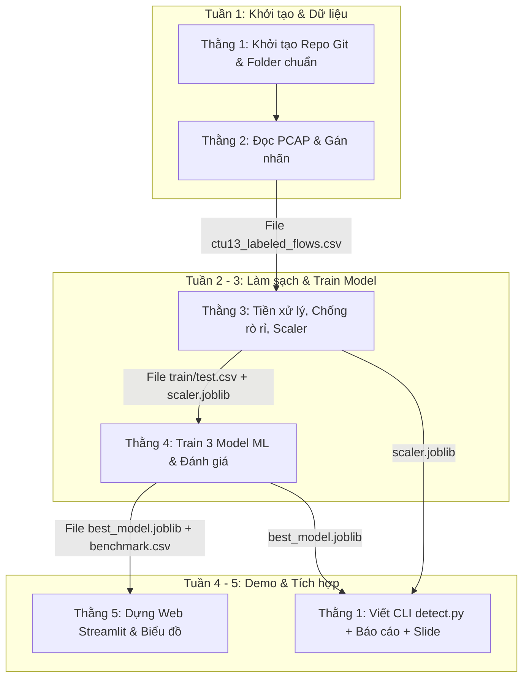

# TO DO LIST & BẢNG PHÂN CÔNG CHI TIẾT (DÀNH CHO 5 THÀNH VIÊN)

> **Dự án**: Xây dựng Pipeline trích xuất đặc trưng và phát hiện Botnet từ lưu lượng mạng PCAP  
> **Môn học**: Ứng dụng Học máy trong An toàn thông tin  
> **Thời gian thực hiện**: 5 tuần  

---

## 🗺️ 1. Sơ đồ Dòng Chảy Dự Án (Pipeline Flow)



---

## 📂 2. Cấu Trúc Thư Mục Chuẩn (Cả 5 Người Tuân Thủ)

```text
Botnet_sexline/
├── data/
│   ├── raw/                 <- Thằng 2 để file PCAP mẫu ở đây
│   └── processed/           <- Chứa ctu13_labeled_flows.csv, train.csv, test.csv
├── models/                  <- Chứa scaler.joblib (Thằng 3), best_model.joblib (Thằng 4)
├── notebooks/               <- Thằng 3 để file phân tích 01_eda.ipynb
├── results/                 <- Thằng 4 & 5 để bảng điểm CSV và hình ảnh biểu đồ PNG
├── src/
│   ├── data/                <- Thằng 2: flow_extractor.py, labeling.py
│   ├── features/            <- Thằng 3: preprocessor.py
│   ├── models/              <- Thằng 4: train.py
│   └── inference/           <- Thằng 1: detect.py
├── scripts/                 <- Thằng 1: run_pipeline.py
├── app.py                   <- Thằng 5: Web Demo Streamlit
├── requirements.txt         <- Thằng 1 quản lý danh sách thư viện
├── README.md
└── TODO_LIST.md
```

---

## 📋 3. TO-DO LIST CHI TIẾT TỪNG THÀNH VIÊN

---

### 👤 THẰNG 1: Leader & Tích Hợp Hệ Thống (System Architect & Integration)
> *"Nhạc trưởng: Quản lý Git, gom code của 4 thằng lại, viết CLI quét cảnh báo, làm báo cáo và slide."*

* **🛠 Dùng công cụ gì?**
  * Git & GitHub (quản lý repo, phân nhánh, review pull request).
  * VS Code, Python 3.10+, thư viện `argparse` hoặc `click`.
  * Microsoft Word / Google Docs (Báo cáo), PowerPoint / Canva (Slide).

* **📥 Điều kiện bắt đầu:**
  * Có danh sách email/tài khoản GitHub của cả 5 bạn.
  * Khi làm CLI/Pipeline: Cần code của Thằng 2, `scaler.joblib` của Thằng 3, `best_model.joblib` của Thằng 4.

* **💻 To-do List (Làm như thế nào?):**
  - [ ] **Tuần 1**: Khởi tạo Git repo, tạo cây thư mục chuẩn, viết file `.gitignore` và `requirements.txt`.
  - [ ] **Tuần 1 - 5**: Họp nhanh đầu tuần, nhắc nhở deadline và hỗ trợ giải quyết xung đột Git (conflict).
  - [ ] **Tuần 4**: Lập trình script CLI `src/inference/detect.py`:
    - Nhận tham số đường dẫn file PCAP: `python src/inference/detect.py --pcap test.pcap`.
    - Gọi module của Thằng 2 (trích xuất luồng) $\rightarrow$ Thằng 3 (chuẩn hóa scaler) $\rightarrow$ Thằng 4 (dự đoán nhãn botnet).
    - In ra màn hình terminal danh sách các IP nghi vấn bị nhiễm Botnet.
  - [ ] **Tuần 4**: Lập trình `scripts/run_pipeline.py` (chạy 1 lệnh tự động hóa toàn bộ luồng từ tiền xử lý đến ra kết quả).
  - [ ] **Tuần 5**: Thu thập tài liệu từ 4 bạn, tổng hợp thành cuốn Báo cáo hoàn chỉnh (Mở đầu, Lý thuyết, Thực nghiệm, Kết luận).
  - [ ] **Tuần 5**: Thiết kế Slide thuyết trình chuyên nghiệp, phân chia lượt nói cho các thành viên.

* **🎯 Yêu cầu kết quả nghiệm thu:**
  - [ ] Repo GitHub sạch sẽ, không lưu file rác/file nặng.
  - [ ] File `src/inference/detect.py` và `scripts/run_pipeline.py` chạy mượt không lỗi.
  - [ ] File Báo cáo `.docx` và Slide thuyết trình `.pptx` hoàn chỉnh.

---

### 👤 THẰNG 2: Kỹ Sư Dữ Liệu Mạng (PCAP Processing & Labeling)
> *"Thợ đào mỏ: Bổ xẻ file PCAP thô thành các dòng dữ liệu thống kê luồng mạng và dán nhãn đâu là Botnet, đâu là luồng sạch."*

* **🛠 Dùng công cụ gì?**
  * Python 3.10+, thư viện `scapy` (hoặc `pyshark`/`dpkt`), `pandas`, `numpy`.
  * Wireshark (để soi mẫu gói tin trong file PCAP).
  * Dataset CTU-13 (chọn 1 kịch bản vừa phải ~50MB - 100MB, ví dụ Scenario 8 hoặc 10).

* **📥 Điều kiện bắt đầu:**
  * Thằng 1 tạo xong repo Git.
  * Tải xong file PCAP và danh sách IP Botnet của kịch bản CTU-13 đã chọn.

* **💻 To-do List (Làm như thế nào?):**
  - [ ] **Tuần 1**: Tải file PCAP mẫu và đặt vào thư mục `data/raw/`.
  - [ ] **Tuần 2**: Lập trình module `src/data/flow_extractor.py`:
    - Đọc gói tin trong PCAP theo batch/stream để tránh tràn RAM.
    - Gom nhóm các gói tin thành các Flow (luồng) theo 5-tuple: `(src_ip, dst_ip, src_port, dst_port, protocol)`.
    - Tính toán các đặc trưng thống kê: `flow_duration`, `total_fwd_pkts`, `total_bwd_pkts`, `total_fwd_bytes`, `total_bwd_bytes`, `bytes_per_sec`, `packets_per_sec`, `packet_len_mean`, `packet_len_std`.
  - [ ] **Tuần 2**: Lập trình module `src/data/labeling.py`:
    - Đọc danh sách Botnet IP từ tài liệu kịch bản CTU-13.
    - So khớp: Nếu `src_ip` hoặc `dst_ip` là Botnet $\rightarrow$ `label = 1` (Botnet), ngược lại $\rightarrow$ `label = 0` (Normal).
  - [ ] **Tuần 2**: Xuất dữ liệu đã gán nhãn ra file `data/processed/ctu13_labeled_flows.csv`.
  - [ ] **Tuần 4**: Viết nội dung Chương 2 Báo cáo (Mô tả tập dữ liệu CTU-13 và ý nghĩa các đặc trưng luồng mạng đã trích xuất) gửi Thằng 1.

* **🎯 Yêu cầu kết quả nghiệm thu:**
  - [ ] Code `flow_extractor.py` và `labeling.py` chạy ổn định, có chú thích rõ ràng.
  - [ ] File `data/processed/ctu13_labeled_flows.csv` có dung lượng hợp lệ (khoảng 20.000 - 100.000 dòng), có đủ cả 2 nhãn 0 và 1, không bị file rỗng.
  - [ ] Bản nháp nội dung Chương 2 gửi cho Leader.

---

### 👤 THẰNG 3: Chuyên Viên Tiền Xử Lý & Chống Rò Rỉ Dữ Liệu (EDA, Preprocessing & Anti-Leakage)
> *"Thợ lọc nước: Nhận bảng dữ liệu thô, lọc bỏ rác, xóa các cột gây học vẹt (IP, Port), chuẩn hóa dữ liệu và chia tập Train/Test."*

* **🛠 Dùng công cụ gì?**
  * Jupyter Notebook, Python 3.10+, `pandas`, `numpy`, `matplotlib`, `seaborn`.
  * `scikit-learn` (`RobustScaler`, `train_test_split`), `joblib`.

* **📥 Điều kiện bắt đầu:**
  * Nhận file `ctu13_labeled_flows.csv` từ Thằng 2.

* **💻 To-do List (Làm như thế nào?):**
  - [ ] **Tuần 2 - 3**: Tạo Jupyter Notebook `notebooks/01_eda.ipynb`:
    - Vẽ biểu đồ phân bố nhãn (kiểm tra tỷ lệ mất cân bằng dữ liệu Botnet vs Normal).
    - Thống kê các giá trị lỗi: dòng chứa `NaN` (trống), `Inf` (vô cùng).
  - [ ] **Tuần 3**: Lập trình module `src/features/preprocessor.py`:
    - Thay thế `Inf` thành `NaN`, xử lý điền giá trị thiếu bằng giá trị trung vị (Median).
    - **CHỐNG RÒ RỈ DỮ LIỆU (Bắt buộc)**: Loại bỏ (Drop) hoàn toàn các cột: `src_ip`, `dst_ip`, `src_port`, `dst_port`, `timestamp`. *(Lý do: Giữ IP/Port sẽ làm mô hình chỉ học vẹt địa chỉ IP thay vì học bản chất hành vi luồng mạng)*.
    - Tách ma trận đặc trưng $X$ và nhãn $y$.
    - Chia tập Train/Test theo tỷ lệ 70% Train - 30% Test (`stratify=y`, `random_state=42`).
    - Dùng `RobustScaler` fit trên tập Train và transform cho cả Train và Test.
    - Lưu scaler ra file `models/scaler.joblib`.
  - [ ] **Tuần 3**: Lưu 2 file dữ liệu đã xử lý: `data/processed/train_data.csv` và `data/processed/test_data.csv`.
  - [ ] **Tuần 4**: Viết nội dung Chương 3 Báo cáo (Kỹ thuật EDA, lý do dùng RobustScaler và phân tích chống Data Leakage) gửi Thằng 1.

* **🎯 Yêu cầu kết quả nghiệm thu:**
  - [ ] Notebook `01_eda.ipynb` có biểu đồ phân tích trực quan.
  - [ ] Code `preprocessor.py` chạy độc lập thành công.
  - [ ] File `train_data.csv` và `test_data.csv` sạch 100% (không còn NaN/Inf, không chứa cột IP/Port).
  - [ ] File `models/scaler.joblib`.
  - [ ] Bản nháp nội dung Chương 3 gửi cho Leader.

---

### 👤 THẰNG 4: Kỹ Sư Machine Learning (Core ML Models & Evaluation)
> *"Bác sĩ bắt bệnh: Luyện 3 thuật toán ML quen thuộc, chấm điểm xem thuật toán nào bắt Botnet xịn nhất và lưu lại mô hình."*

* **🛠 Dùng công cụ gì?**
  * Python 3.10+, `scikit-learn`, `joblib`, `pandas`.
  * Thuật toán: `LogisticRegression`, `DecisionTreeClassifier`, `RandomForestClassifier`.
  * Chỉ số đánh giá: `accuracy_score`, `precision_score`, `recall_score`, `f1_score`, `confusion_matrix`.

* **📥 Điều kiện bắt đầu:**
  * Nhận `train_data.csv` và `test_data.csv` từ Thằng 3.

* **💻 To-do List (Làm như thế nào?):**
  - [ ] **Tuần 3**: Lập trình script huấn luyện `src/models/train.py`:
    - Đọc dữ liệu Train và Test.
    - Cấu hình và huấn luyện 3 mô hình Scikit-Learn:
      1. `LogisticRegression(max_iter=1000)` (Baseline so sánh)
      2. `DecisionTreeClassifier(max_depth=10, random_state=42)`
      3. `RandomForestClassifier(n_estimators=100, max_depth=15, random_state=42, n_jobs=-1)`
  - [ ] **Tuần 3**: Đo lường và đánh giá kết quả trên tập Test:
    - Tính: `Accuracy`, `Precision`, `Recall`, `F1-Score`.
    - **Tính chỉ số FPR (False Positive Rate)**: $\text{FPR} = \frac{\text{FP}}{\text{FP} + \text{TN}}$ (Tỷ lệ báo động nhầm - cực kỳ quan trọng trong An toàn thông tin).
  - [ ] **Tuần 3**: Xuất bảng điểm số so sánh ra file `results/benchmark_results.csv`.
  - [ ] **Tuần 3**: Chọn mô hình có F1-Score và FPR tối ưu nhất (thường là Random Forest), lưu thành `models/best_model.joblib`.
  - [ ] **Tuần 4**: Viết nội dung Chương 4 Báo cáo (So sánh lý thuyết & kết quả thực nghiệm 3 thuật toán) gửi Thằng 1.

* **🎯 Yêu cầu kết quả nghiệm thu:**
  - [ ] Script `src/models/train.py` chạy bằng lệnh `python src/models/train.py` cho ra kết quả ngay.
  - [ ] File mô hình `models/best_model.joblib`.
  - [ ] File bảng điểm `results/benchmark_results.csv` có đủ các chỉ số (Model, Accuracy, Precision, Recall, F1, FPR).
  - [ ] Bản nháp nội dung Chương 4 gửi cho Leader.

---

### 👤 THẰNG 5: Kỹ Sư Trực Quan Hóa & Web Demo (Visualization & Streamlit UI)
> *"Người trình diễn: Vẽ các biểu đồ kết quả thật đẹp mắt và dựng Web Streamlit để bấm demo trực tiếp trước giảng viên."*

* **🛠 Dùng công cụ gì?**
  * Python 3.10+, thư viện `streamlit` (dựng web siêu tốc bằng Python).
  * `matplotlib`, `seaborn` (vẽ biểu đồ).

* **📥 Điều kiện bắt đầu:**
  * Nhận `best_model.joblib` và `benchmark_results.csv` từ Thằng 4.
  * Nhận hàm trích xuất/chuẩn hóa từ Thằng 2 & Thằng 3 để nối vào luồng quét file.

* **💻 To-do List (Làm như thế nào?):**
  - [ ] **Tuần 3 - 4**: Viết script sinh biểu đồ đồ họa:
    - Vẽ ma trận nhầm lẫn (Confusion Matrix) dạng Heatmap $\rightarrow$ Lưu vào `results/confusion_matrix.png`.
    - Đọc `feature_importances_` từ Random Forest của Thằng 4, vẽ biểu đồ thanh Top 10 đặc trưng quan trọng nhất $\rightarrow$ Lưu vào `results/feature_importance.png`.
  - [ ] **Tuần 4**: Lập trình ứng dụng Web `app.py` bằng **Streamlit**:
    - **Tab 1 - Dashboard Đánh Giá**: Hiển thị bảng số liệu so sánh của Thằng 4 kèm 2 biểu đồ PNG ở trên.
    - **Tab 2 - Trình Quét Trực Tiếp (Live Scanner)**:
      - Cho phép tải lên file PCAP (hoặc chọn file mẫu có sẵn).
      - Bấm nút `[🚀 Phân tích lưu lượng]`.
      - Hiển thị số liệu tổng quan: Tổng số luồng, Số luồng Botnet phát hiện, Tỷ lệ lây nhiễm (%).
      - Hiển thị bảng cảnh báo chi tiết các địa chỉ IP bị nghi ngờ nhiễm Botnet.
  - [ ] **Tuần 4 - 5**: Chuẩn bị sẵn kịch bản demo: 1 file PCAP sạch (tỷ lệ 0%) và 1 file PCAP dính Botnet (tỷ lệ cao) để demo trơn tru trong 3 phút.
  - [ ] **Tuần 5**: Chụp ảnh màn hình Web Demo, viết nội dung Chương 5 Báo cáo (Hướng dẫn sử dụng và minh họa kết quả) gửi Thằng 1.

* **🎯 Yêu cầu kết quả nghiệm thu:**
  - [ ] Ứng dụng Web `app.py` khởi chạy mượt mà bằng lệnh `streamlit run app.py`.
  - [ ] 2 file ảnh trực quan: `confusion_matrix.png` và `feature_importance.png`.
  - [ ] Kịch bản bấm demo trực tiếp mượt mà trước hội đồng.
  - [ ] Bản nháp nội dung Chương 5 gửi cho Leader.

---

## 🔄 4. Ma Trận Bàn Giao Sản Phẩm (Handoff Matrix)

| Người gửi | Sản phẩm bàn giao (File cụ thể) | Người nhận | Dùng để làm gì? |
| :--- | :--- | :--- | :--- |
| **Thằng 1** | Repo Git, Cấu trúc thư mục, `requirements.txt` | Cả nhóm | Bắt đầu clone về code đồng bộ |
| **Thằng 2** | `data/processed/ctu13_labeled_flows.csv` | **Thằng 3** | Làm sạch, bỏ rác, loại bỏ cột rò rỉ dữ liệu |
| **Thằng 3** | `train_data.csv`, `test_data.csv` | **Thằng 4** | Đưa vào huấn luyện và đánh giá 3 model ML |
| **Thằng 3** | `models/scaler.joblib` | **Thằng 1, 5** | Chuẩn hóa dữ liệu mới khi chạy demo/CLI |
| **Thằng 4** | `models/best_model.joblib` | **Thằng 1, 5** | Nạp vào suy diễn dự đoán Botnet trên CLI & Web |
| **Thằng 4** | `results/benchmark_results.csv` | **Thằng 5** | Hiển thị bảng điểm trên giao diện Web |
| **Thằng 5** | Ảnh biểu đồ (`.png`) & Ảnh chụp Web Demo | **Thằng 1** | Chèn vào Báo cáo Word và Slide |
| **Thằng 2, 3, 4, 5** | Bản nháp nội dung chương (Word) tương ứng | **Thằng 1** | Tổng hợp thành cuốn Báo cáo hoàn chỉnh |

---

## 💡 5. 3 Quy Tắc Vàng Để Nhóm Không Bị "Toang"

1. **Quy tắc Git Branch**:
   * Không bao giờ commit trực tiếp lên nhánh `main`.
   * Mỗi thành viên tạo nhánh riêng:
     * Thằng 2: `feature/pcap-extraction`
     * Thằng 3: `feature/data-preprocessing`
     * Thằng 4: `feature/ml-training`
     * Thằng 5: `feature/streamlit-ui`
   * Test chạy mượt trên máy mình rồi mới tạo Pull Request để Thằng 1 review và gộp vào `main`.

2. **Quy tắc File Nặng**:
   * Không đẩy file `.pcap` hoặc `.csv` dung lượng hàng trăm MB lên Git.
   * Cấu hình `.gitignore` chặn các file này. Chia sẻ dữ liệu thô qua Google Drive của nhóm.

3. **Quy tắc Môi Trường (requirements.txt)**:
   * Cả nhóm cài chung 1 môi trường ảo Python 3.10+:
   ```bash
   pip install -r requirements.txt
   ```
   * Danh sách thư viện chuẩn:
     ```text
     pandas>=2.0.0
     numpy>=1.24.0
     scapy>=2.5.0
     scikit-learn>=1.3.0
     matplotlib>=3.7.0
     seaborn>=0.12.0
     streamlit>=1.28.0
     joblib>=1.3.0
     ```

