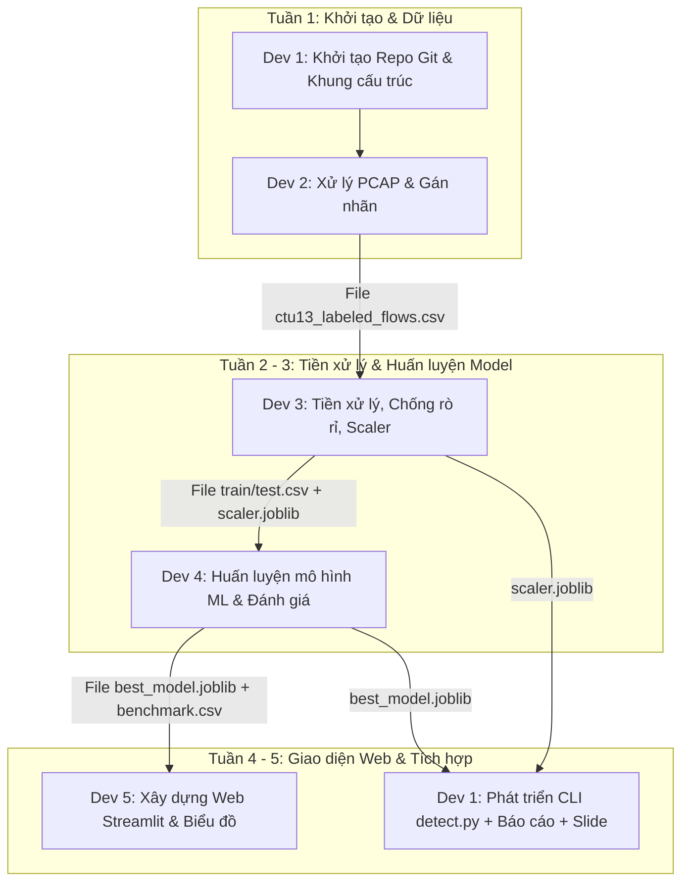

# BẢNG PHÂN CÔNG NHIỆM VỤ & TO-DO LIST CHI TIẾT (5 THÀNH VIÊN)

> **Dự án**: Xây dựng Pipeline trích xuất đặc trưng và phát hiện Botnet từ lưu lượng mạng PCAP  
> **Môn học**: Ứng dụng Học máy trong An toàn thông tin  
> **Thời gian thực hiện**: 5 tuần  

---

## 🗺️ 1. Sơ đồ Dòng Chảy Dự Án (Pipeline Flow)



---

## 📂 2. Cấu Trúc Thư Mục Dự Án Chuẩn

```text
Botnet_sexline/
├── data/
│   ├── raw/                 <- Dev 2 lưu file PCAP mẫu
│   └── processed/           <- Chứa ctu13_labeled_flows.csv, train.csv, test.csv
├── models/                  <- Chứa scaler.joblib (Dev 3), best_model.joblib (Dev 4)
├── notebooks/               <- Dev 3 thực hiện phân tích 01_eda.ipynb
├── results/                 <- Dev 4 & Dev 5 lưu bảng điểm CSV và biểu đồ PNG
├── src/
│   ├── data/                <- Dev 2: flow_extractor.py, labeling.py
│   ├── features/            <- Dev 3: preprocessor.py
│   ├── models/              <- Dev 4: train.py
│   └── inference/           <- Dev 1: detect.py
├── scripts/                 <- Dev 1: run_pipeline.py
├── app.py                   <- Dev 5: Web Demo Streamlit
├── requirements.txt         <- Quản lý danh sách thư viện chung
├── README.md
└── TODO_LIST.md
```

---

## 📋 3. BẢNG NHIỆM VỤ CHI TIẾT TỪNG THÀNH VIÊN (DEV 1 - DEV 5)

---

### 👤 DEV 1: Leader & Tích Hợp Hệ Thống (System Architect & Integration)
* **Vai trò**: Quản trị kho mã nguồn, kết nối các thành phần hệ thống, xây dựng công cụ dòng lệnh (CLI), biên soạn Báo cáo tổng kết và Slide thuyết trình.
* **🛠 Công cụ sử dụng**:
  * Git & GitHub (quản lý repository, phân nhánh, review Pull Request).
  * VS Code, Python 3.10+, thư viện `argparse` hoặc `click`.
  * Microsoft Word / Google Docs (Báo cáo), PowerPoint / Canva (Slide).

* **📥 Điều kiện đầu vào**:
  * Danh sách thông tin tài khoản GitHub của các thành viên.
  * Tích hợp hệ thống: Nhận module trích xuất từ Dev 2, bộ chuẩn hóa `scaler.joblib` từ Dev 3, mô hình `best_model.joblib` từ Dev 4.

* **💻 To-do List (Quy trình thực hiện):**
  - [ ] **Tuần 1**: Khởi tạo Git repo, tạo cây thư mục chuẩn, cấu hình `.gitignore` và `requirements.txt`.
  - [ ] **Tuần 1 - 5**: Họp điều phối hàng tuần, theo dõi tiến độ và hỗ trợ giải quyết xung đột mã nguồn (Git conflict).
  - [ ] **Tuần 4**: Lập trình công cụ dòng lệnh `src/inference/detect.py`:
    - Nhận đường dẫn file PCAP: `python src/inference/detect.py --pcap test.pcap`.
    - Kết nối luồng: Trích xuất đặc trưng (Dev 2) $\rightarrow$ Chuẩn hóa dữ liệu (Dev 3) $\rightarrow$ Dự đoán phân loại Botnet (Dev 4).
    - Xuất thông báo cảnh báo danh sách địa chỉ IP nghi vấn bị xâm nhập.
  - [ ] **Tuần 4**: Lập trình script tự động hóa `scripts/run_pipeline.py` (chạy toàn bộ quy trình từ tiền xử lý đến ra kết quả).
  - [ ] **Tuần 5**: Thu thập các chương nội dung từ các thành viên, hoàn thiện Báo cáo tổng kết (Word) và Slide thuyết trình chuyên nghiệp.

* **🎯 Sản phẩm bàn giao & Tiêu chí nghiệm thu:**
  - [ ] Repository GitHub được cấu trúc chuẩn hóa, có commit đầy đủ từ các thành viên.
  - [ ] Script `src/inference/detect.py` và `scripts/run_pipeline.py` vận hành chính xác, không phát sinh lỗi.
  - [ ] Bản Báo cáo khoa học (`.docx`) và Slide thuyết trình (`.pptx`) chỉn chu.

---

### 👤 DEV 2: Kỹ Sư Dữ Liệu Mạng (PCAP Processing & Labeling)
* **Vai trò**: Xử lý gói tin mạng thô từ file PCAP, gom luồng truyền thông (Network Flow), tính toán các đặc trưng thống kê và gán nhãn dữ liệu dựa trên danh sách Botnet IP.
* **🛠 Công cụ sử dụng**:
  * Python 3.10+, thư viện `scapy` (hoặc `pyshark`/`dpkt`), `pandas`, `numpy`.
  * Wireshark (kiểm tra cấu trúc gói tin PCAP).
  * Tập dữ liệu chuẩn CTU-13 (kịch bản mẫu ~50MB - 100MB, ví dụ Scenario 8 hoặc 10).

* **📥 Điều kiện đầu vào**:
  * Dev 1 hoàn thành cấu trúc thư mục trên GitHub.
  * Tải về file `.pcap` và tài liệu mô tả địa chỉ IP Botnet tương ứng từ CTU-13.

* **💻 To-do List (Quy trình thực hiện):**
  - [ ] **Tuần 1**: Tải dữ liệu PCAP và lưu vào thư mục `data/raw/`.
  - [ ] **Tuần 2**: Xây dựng module `src/data/flow_extractor.py`:
    - Đọc luồng gói tin theo khối dữ liệu (batch/stream) để tối ưu hóa bộ nhớ RAM.
    - Gom nhóm các gói tin thành các Flow theo 5-tuple: `(src_ip, dst_ip, src_port, dst_port, protocol)`.
    - Tính toán các đặc trưng thống kê: `flow_duration`, `total_fwd_pkts`, `total_bwd_pkts`, `total_fwd_bytes`, `total_bwd_bytes`, `bytes_per_sec`, `packets_per_sec`, `packet_len_mean`, `packet_len_std`.
  - [ ] **Tuần 2**: Xây dựng module `src/data/labeling.py`:
    - Đọc danh sách IP Botnet từ tài liệu kịch bản CTU-13.
    - So khớp: Nếu `src_ip` hoặc `dst_ip` nằm trong danh sách nhiễm $\rightarrow$ `label = 1` (Botnet), ngược lại $\rightarrow$ `label = 0` (Normal).
  - [ ] **Tuần 2**: Xuất tập dữ liệu đã gán nhãn ra file `data/processed/ctu13_labeled_flows.csv`.
  - [ ] **Tuần 4**: Soạn thảo nội dung Chương 2 Báo cáo (Cơ sở lý thuyết về tập dữ liệu CTU-13 và phương pháp trích xuất đặc trưng luồng mạng) gửi Dev 1.

* **🎯 Sản phẩm bàn giao & Tiêu chí nghiệm thu:**
  - [ ] Mã nguồn `flow_extractor.py` và `labeling.py` hoàn thiện, có chú thích rõ ràng.
  - [ ] File dữ liệu `data/processed/ctu13_labeled_flows.csv` đầy đủ (khoảng 20.000 - 100.000 bản ghi), phân bố đủ 2 lớp nhãn, không chứa dữ liệu rỗng.
  - [ ] Bản thảo nội dung Chương 2 nộp cho Leader.

---

### 👤 DEV 3: Chuyên Viên Tiền Xử Lý & Chống Rò Rỉ Dữ Liệu (EDA, Preprocessing & Anti-Leakage)
* **Vai trò**: Phân tích khám phá dữ liệu (EDA), xử lý dữ liệu khuyết thiếu/bất thường, loại bỏ triệt để các đặc trưng gây rò rỉ thông tin (Anti-Leakage), chuẩn hóa thang đo và phân chia tập huấn luyện/kiểm thử.
* **🛠 Công cụ sử dụng**:
  * Jupyter Notebook, Python 3.10+, `pandas`, `numpy`, `matplotlib`, `seaborn`.
  * `scikit-learn` (`RobustScaler`, `train_test_split`), `joblib` / `pickle`.

* **📥 Điều kiện đầu vào**:
  * Tiếp nhận file `ctu13_labeled_flows.csv` từ Dev 2.

* **💻 To-do List (Quy trình thực hiện):**
  - [ ] **Tuần 2 - 3**: Xây dựng Jupyter Notebook `notebooks/01_eda.ipynb`:
    - Khảo sát trực quan phân bố nhãn (đánh giá mức độ mất cân bằng lớp giữa Botnet và Normal).
    - Thống kê các giá trị dị biệt: các dòng chứa `NaN` hoặc `Inf` (vô cùng).
  - [ ] **Tuần 3**: Xây dựng module `src/features/preprocessor.py`:
    - Xử lý các giá trị vô cùng `Inf` thành `NaN` và điền khuyết thiếu bằng giá trị trung vị (Median).
    - **CHỐNG RÒ RỈ DỮ LIỆU (Yêu cầu bắt buộc)**: Loại bỏ hoàn toàn các trường định danh: `src_ip`, `dst_ip`, `src_port`, `dst_port`, `timestamp` để tránh việc mô hình học vẹt địa chỉ thay vì học hành vi luồng mạng.
    - Tách ma trận đặc trưng $X$ và vector nhãn $y$.
    - Phân chia tập dữ liệu: 70% Huấn luyện (Train) - 30% Kiểm thử (Test) với thiết lập phân tầng (`stratify=y`, `random_state=42`).
    - Ứng dụng `RobustScaler` để chuẩn hóa (tăng cường khả năng thích ứng với các giá trị ngoại lai).
    - Lưu trữ bộ biến đổi vào `models/scaler.joblib`.
  - [ ] **Tuần 3**: Lưu 2 tập dữ liệu chuẩn: `data/processed/train_data.csv` và `data/processed/test_data.csv`.
  - [ ] **Tuần 4**: Soạn thảo nội dung Chương 3 Báo cáo (Quy trình tiền xử lý, cơ sở lựa chọn RobustScaler và giải trình cơ chế phòng chống Data Leakage) gửi Dev 1.

* **🎯 Sản phẩm bàn giao & Tiêu chí nghiệm thu:**
  - [ ] Notebook `01_eda.ipynb` hoàn chỉnh biểu đồ và nhận xét phân tích.
  - [ ] Module `preprocessor.py` thực thi độc lập thành công.
  - [ ] 2 file `train_data.csv` và `test_data.csv` sạch hoàn toàn (không còn giá trị khuyết thiếu hay các cột IP/Port).
  - [ ] File bộ chuẩn hóa `models/scaler.joblib`.
  - [ ] Bản thảo nội dung Chương 3 nộp cho Leader.

---

### 👤 DEV 4: Kỹ Sư Machine Learning (Core ML Models & Evaluation)
* **Vai trò**: Triển khai huấn luyện các thuật toán học máy, tối ưu tham số cơ bản, đánh giá hiệu năng theo các chỉ số chuyên biệt trong An toàn thông tin và lưu trữ mô hình tối ưu nhất.
* **🛠 Công cụ sử dụng**:
  * Python 3.10+, `scikit-learn`, `pickle` / `joblib`, `pandas`.
  * Mô hình: `LogisticRegression`, `DecisionTreeClassifier`, `RandomForestClassifier`, `MLPClassifier`.
  * Chỉ số đánh giá: `accuracy_score`, `precision_score`, `recall_score`, `f1_score`, `confusion_matrix`.

* **📥 Điều kiện đầu vào**:
  * Tiếp nhận `train_data.csv` và `test_data.csv` từ Dev 3.

* **💻 To-do List (Quy trình thực hiện):**
  - [ ] **Tuần 3**: Xây dựng script huấn luyện `src/models/train.py`:
    - Nạp dữ liệu huấn luyện và kiểm thử.
    - Cấu hình và huấn luyện các mô hình phân loại:
      1. `LogisticRegression` (Mô hình cơ sở - Baseline)
      2. `DecisionTreeClassifier`
      3. `RandomForestClassifier`
      4. `MLPClassifier` (Mạng nơ-ron đa tầng)
  - [ ] **Tuần 3**: Đo lường và đánh giá hiệu năng mô hình trên tập Test:
    - Tính toán: `Accuracy`, `Precision`, `Recall`, `F1-Score`.
    - **Tính toán tỷ lệ báo động giả (False Positive Rate - FPR)**: $\text{FPR} = \frac{\text{FP}}{\text{FP} + \text{TN}}$ (Chỉ số kiểm soát báo động giả phục vụ vận hành SOC).
  - [ ] **Tuần 3**: Xuất bảng tổng hợp kết quả so sánh vào `results/benchmark_results.csv`.
  - [ ] **Tuần 3**: Lựa chọn mô hình có sự cân bằng F1-Score và FPR tối ưu nhất, đóng gói thành `models/best_model.joblib`.
  - [ ] **Tuần 4**: Soạn thảo nội dung Chương 4 Báo cáo (So sánh lý thuyết thuật toán và phân tích kết quả thực nghiệm) gửi Dev 1.

* **🎯 Sản phẩm bàn giao & Tiêu chí nghiệm thu:**
  - [ ] Script `src/models/train.py` thực thi ổn định bằng lệnh `python src/models/train.py`.
  - [ ] File mô hình đóng gói `models/best_model.joblib`.
  - [ ] Bảng dữ liệu đánh giá `results/benchmark_results.csv` đầy đủ các trường đo lường.
  - [ ] Bản thảo nội dung Chương 4 nộp cho Leader.

---

### 👤 DEV 5: Kỹ Sư Trực Quan Hóa & Giao Diện Người Dùng (Visualization & Streamlit UI)
* **Vai trò**: Thiết kế các biểu đồ đánh giá chuyên sâu (Ma trận nhầm lẫn, Tầm quan trọng của đặc trưng), lập trình ứng dụng Web Demo (Streamlit) cho phép tải file PCAP và phát hiện xâm nhập trực quan.
* **🛠 Công cụ sử dụng**:
  * Python 3.10+, thư viện `streamlit`.
  * `matplotlib`, `seaborn` (trực quan hóa dữ liệu).

* **📥 Điều kiện đầu vào**:
  * Tiếp nhận `best_model.joblib` và bảng điểm `benchmark_results.csv` từ Dev 4.
  * Tiếp nhận hàm trích xuất/chuẩn hóa từ Dev 2 và Dev 3 để tích hợp vào giao diện quét file.

* **💻 To-do List (Quy trình thực hiện):**
  - [ ] **Tuần 3 - 4**: Lập trình script trực quan hóa số liệu:
    - Vẽ ma trận nhầm lẫn (Confusion Matrix) dạng biểu đồ nhiệt (Heatmap) $\rightarrow$ Lưu vào `results/confusion_matrix.png`.
    - Khảo sát thuộc tính `feature_importances_` từ Random Forest, trực quan Top 10 đặc trưng quan trọng nhất $\rightarrow$ Lưu vào `results/feature_importance.png`.
  - [ ] **Tuần 4**: Xây dựng ứng dụng Web `app.py` bằng nền tảng **Streamlit**:
    - **Tab 1 - Dashboard Đánh Giá**: Hiển thị bảng so sánh các chỉ số thực nghiệm của Dev 4 kèm các biểu đồ trực quan.
    - **Tab 2 - Trình Quét Lưu Lượng (Live Scanner)**:
      - Cung cấp giao diện tải file PCAP (hoặc lựa chọn mẫu thử nghiệm có sẵn).
      - Nút điều khiển `[🚀 Phân tích lưu lượng]`.
      - Hiển thị các chỉ số tổng quan: Tổng số luồng mạng, Số luồng Botnet phát hiện, Tỷ lệ lây nhiễm (%).
      - Bảng cảnh báo chi tiết các địa chỉ IP bị nghi vấn Botnet nhằm phục vụ ứng cứu sự cố.
  - [ ] **Tuần 4 - 5**: Chuẩn bị kịch bản thuyết minh Demo: Chuẩn bị sẵn 1 mẫu PCAP sạch và 1 mẫu PCAP chứa tấn công để trình diễn thực tế trong 3 phút.
  - [ ] **Tuần 5**: Chụp ảnh giao diện hoàn chỉnh, soạn thảo nội dung Chương 5 Báo cáo (Hướng dẫn vận hành hệ thống và minh họa kết quả) gửi Dev 1.

* **🎯 Sản phẩm bàn giao & Tiêu chí nghiệm thu:**
  - [ ] Ứng dụng Web `app.py` khởi động mượt mà bằng lệnh `streamlit run app.py`.
  - [ ] Bộ ảnh biểu đồ trực quan chất lượng cao: `confusion_matrix.png` và `feature_importance.png`.
  - [ ] Kịch bản trình diễn Demo thực tế trước hội đồng đánh giá.
  - [ ] Bản thảo nội dung Chương 5 nộp cho Leader.

---

## 🔄 4. Ma Trận Bàn Giao Sản Phẩm (Handoff Matrix)

| Người chuyển giao | Sản phẩm bàn giao (File cụ thể) | Người tiếp nhận | Mục đích sử dụng |
| :--- | :--- | :--- | :--- |
| **Dev 1** | Repo Git, Cấu trúc dự án, `requirements.txt` | Toàn đội ngũ | Khởi tạo môi trường và đồng bộ mã nguồn |
| **Dev 2** | `data/processed/ctu13_labeled_flows.csv` | **Dev 3** | Làm sạch, xử lý bất thường và loại bỏ rò rỉ dữ liệu |
| **Dev 3** | `train_data.csv`, `test_data.csv` | **Dev 4** | Cung cấp dữ liệu huấn luyện và kiểm thử mô hình |
| **Dev 3** | `models/scaler.joblib` | **Dev 1, Dev 5** | Chuẩn hóa các mẫu dữ liệu mới trong quá trình suy diễn |
| **Dev 4** | `models/best_model.joblib` | **Dev 1, Dev 5** | Nạp mô hình phục vụ dự đoán phân loại trên CLI và Web |
| **Dev 4** | `results/benchmark_results.csv` | **Dev 5** | Trình diễn số liệu so sánh trên giao diện Web |
| **Dev 5** | Biểu đồ đồ họa (`.png`) & Ảnh chụp giao diện | **Dev 1** | Tích hợp vào Báo cáo tổng kết và Slide thuyết trình |
| **Dev 2, 3, 4, 5** | Bản thảo nội dung chương tương ứng (Word) | **Dev 1** | Biên tập và tổng hợp thành cuốn Báo cáo hoàn chỉnh |

---

## 💡 5. 3 Quy Tắc Vàng Đảm Bảo Tiến Độ Dự Án

1. **Quy tắc phân nhánh Git (Git Branching)**:
   * Không thực hiện commit trực tiếp lên nhánh chính `main`.
   * Mỗi thành viên phát triển trên nhánh chức năng riêng biệt:
     * Dev 2: `feature/pcap-extraction`
     * Dev 3: `feature/data-preprocessing`
     * Dev 4: `feature/ml-training`
     * Dev 5: `feature/streamlit-ui`
   * Kiểm thử hoàn chỉnh trên môi trường cá nhân trước khi tạo Pull Request để Dev 1 duyệt gộp vào `main`.

2. **Quy tắc quản lý dữ liệu lớn**:
   * Tuyệt đối không đưa các tệp dữ liệu dung lượng lớn (`.pcap`, `.csv`) lên Git repository.
   * Cấu hình file `.gitignore` để tự động loại trừ. Chia sẻ dữ liệu thô thông qua kho lưu trữ đám mây dùng chung.

3. **Quy tắc đồng bộ môi trường phát triển**:
   * Tất cả thành viên sử dụng phiên bản Python 3.10+ đồng nhất.
   * Cài đặt phụ thuộc thông qua lệnh chuẩn:
   ```bash
   pip install -r requirements.txt
   ```
   * Danh mục thư viện quy chuẩn:
     ```text
     pandas>=2.0.0
     numpy>=1.24.0
     scapy>=2.5.0
     scikit-learn>=1.3.0
     matplotlib>=3.7.0
     seaborn>=0.12.0
     streamlit>=1.28.0
     joblib>=1.3.0
     ```
