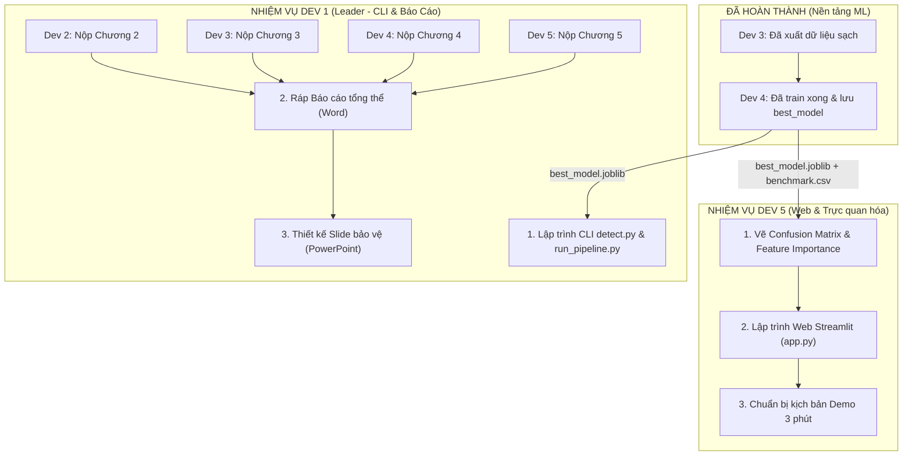

# TO-DO LIST GIAI ĐOẠN 2: CHẶNG VỀ ĐÍCH (SPRINT 2 - NGÀY 9 ĐẾN NGÀY 14)
# TÍCH HỢP HỆ THỐNG, WEB DEMO STREAMLIT, CLI & BÁO CÁO BẢO VỆ

> **Dự án**: Xây dựng Pipeline trích xuất đặc trưng và phát hiện Botnet từ lưu lượng mạng PCAP  
> **Môn học**: Ứng dụng Học máy trong An toàn thông tin  
> **Trạng thái hiện tại**: Đã hoàn thành 60% khối lượng dự án (Đã bóc tách PCAP, làm sạch dữ liệu, và huấn luyện xong 4 mô hình ML).  

---

## 📊 1. Bảng Đánh Giá Tiến Độ Dự Án Đến Hiện Tại

| Thành viên | Nhiệm vụ chính | Trạng thái kỹ thuật | Sản phẩm bàn giao |
| :--- | :--- | :---: | :--- |
| **Dev 2** | Trích xuất luồng PCAP & Gán nhãn | ✅ **HOÀN THÀNH** | `data/processed/ctu13_labeled_flows.csv` |
| **Dev 3** | Tiền xử lý, Chống Data Leakage, Scaler | ✅ **HOÀN THÀNH** | `data/train_processed.csv`, `data/test_processed.csv` |
| **Dev 4** | Huấn luyện 4 mô hình ML trên data thật | ✅ **HOÀN THÀNH** | `models/best_model.joblib`, `results/benchmark_results.csv` |
| **Dev 5** | Dựng Web Demo Streamlit & Trực quan hóa | ⏳ **ĐANG THỰC HIỆN** | `app.py`, biểu đồ `confusion_matrix.png`, `feature_importance.png` |
| **Dev 1** | Tích hợp CLI, Pipeline, Báo cáo & Slide | ⏳ **ĐANG THỰC HIỆN** | `src/inference/detect.py`, `scripts/run_pipeline.py`, Báo cáo Word & Slide |

---

## 🗺️ 2. Sơ đồ Dòng Chảy Giai Đoạn 2 (Integration & Delivery Flow)



---

## 📋 3. BẢNG PHÂN CÔNG TO-DO LIST CHI TIẾT GIAI ĐOẠN 2

---

### 👤 DEV 4: Kỹ Sư Machine Learning (Chặng Cuối)
* **Trạng thái**: Phần lập trình mô hình đã xong 100%. Cần hoàn tất bàn giao và viết văn bản.
* **To-do List:**
  - [x] Huấn luyện 4 mô hình: Logistic Regression, Decision Tree, Random Forest, MLP trên dữ liệu thật của Dev 3.
  - [x] Đánh giá các chỉ số: Accuracy, Precision, Recall, F1-Score, FPR.
  - [x] Xuất bảng kết quả `results/benchmark_results.csv` và mô hình tối ưu `models/best_model.joblib`.
  - [ ] **Ngày 9 - 10**: Push toàn bộ kết quả lên GitHub:
    ```bash
    git add models/best_model.joblib results/benchmark_results.csv src/models/train.py
    git commit -m "Dev4: Hoan thanh huan luyen tren du lieu that va xuat best_model"
    git push origin Dev4
    ```
  - [ ] **Ngày 10**: Báo cho Dev 5 và Dev 1 pull nhánh `Dev4` về để lấy model và bảng điểm.
  - [ ] **Ngày 10 - 12**: Soạn thảo nội dung **Chương 4 Báo cáo (Word)** nộp cho Leader (Dev 1):
    - Cơ sở lý thuyết của 4 thuật toán Machine Learning.
    - Phân tích bài toán mất cân bằng lớp cực đoan trong ATTT (73.000 luồng sạch vs 34 luồng Botnet).
    - Phân tích bảng số liệu thực nghiệm và giải thích cơ sở chọn lựa mô hình xuất sắc nhất.

---

### 👤 DEV 5: Kỹ Sư Trực Quan Hóa & Giao Diện Người Dùng (Trọng Tâm Giai Đoạn 2)
* **Trạng thái**: Tiếp nhận sản phẩm từ Dev 4 để xây dựng bộ mặt trực quan cho toàn dự án.
* **To-do List:**
  - [ ] **Ngày 10**: Kéo nhánh `Dev4` về máy để lấy dữ liệu kết quả:
    ```bash
    git checkout Dev5
    git merge Dev4 -m "Merge Dev4: Lay best_model va benchmark results"
    ```
  - [ ] **Ngày 10 - 11**: Lập trình script sinh 2 biểu đồ trực quan (lưu vào thư mục `results/`):
    - `results/confusion_matrix.png`: Biểu đồ nhiệt (Heatmap) thể hiện tỷ lệ bắt trúng và báo động giả.
    - `results/feature_importance.png`: Biểu đồ cột ngang thể hiện Top 10 đặc trưng luồng mạng có trọng số phân loại cao nhất từ mô hình Random Forest.
  - [ ] **Ngày 11 - 12**: Lập trình ứng dụng Web `app.py` bằng **Streamlit**:
    - **Tab 1 - Dashboard Đánh Giá**: Hiển thị bảng so sánh số liệu thực nghiệm kèm 2 biểu đồ đã vẽ.
    - **Tab 2 - Trình Quét Trực Tiếp (Live Scanner)**:
      - Cho phép người dùng upload file `.pcap` (hoặc chọn tệp mẫu có sẵn).
      - Nút bấm `[🚀 Phân tích lưu lượng]`.
      - Hiển thị KPI: Tổng số luồng, Số luồng Botnet phát hiện, Tỷ lệ lây nhiễm (%).
      - Bảng cảnh báo: Danh sách các địa chỉ IP nguồn/đích bị nghi vấn xâm nhập để quản trị viên SOC cách ly.
  - [ ] **Ngày 12 - 13**: Chuẩn bị kịch bản Demo 3 phút trước giảng viên (chuẩn bị 1 file PCAP sạch và 1 file PCAP có Botnet để bấm trực tiếp).
  - [ ] **Ngày 13**: Chụp ảnh các màn hình Web Demo, soạn thảo **Chương 5 Báo cáo (Word)** nộp cho Dev 1.

---

### 👤 DEV 1: Leader & Tích Hợp Hệ Thống (Trọng Tâm Giai Đoạn 2)
* **Trạng thái**: Kết nối các module thành hệ thống hoàn chỉnh và chủ trì hồ sơ báo cáo.
* **To-do List:**
  - [ ] **Ngày 10**: Kéo nhánh `Dev4` về máy để lấy `best_model.joblib`.
  - [ ] **Ngày 10 - 11**: Lập trình công cụ dòng lệnh CLI `src/inference/detect.py`:
    - Chạy từ terminal: `python src/inference/detect.py --pcap path/to/file.pcap`.
    - Gọi hàm trích xuất luồng (Dev 2) $\rightarrow$ gọi chuẩn hóa scaler (Dev 3) $\rightarrow$ nạp `best_model.joblib` dự đoán $\rightarrow$ in danh sách IP độc hại ra màn hình.
  - [ ] **Ngày 11 - 12**: Xây dựng script tích hợp điều phối tự động `scripts/run_pipeline.py`.
  - [ ] **Ngày 12 - 13**: Thu thập toàn bộ nội dung từ các thành viên:
    - Chương 1: Mở đầu & Mục tiêu đề tài (Dev 1).
    - Chương 2: Tổng quan dữ liệu CTU-13 & Đặc trưng luồng mạng (Dev 2).
    - Chương 3: Tiền xử lý, Chuẩn hóa & Chống rò rỉ dữ liệu (Dev 3).
    - Chương 4: Huấn luyện & Đánh giá 4 mô hình Machine Learning (Dev 4).
    - Chương 5: Triển khai Ứng dụng Web Demo & Kịch bản thực nghiệm (Dev 5).
    - Chương 6: Kết luận & Hướng phát triển (Dev 1).
  - [ ] **Ngày 13 - 14**: Định dạng chuẩn học thuật cho cuốn Báo cáo (`Bao_cao_Botnet.docx`) và thiết kế Slide thuyết trình chỉn chu (`Slide_Bao_ve.pptx`).

---

### 👤 DEV 2 & DEV 3: Chặng Cuối Văn Bản
* **To-do List:**
  - [ ] **Dev 2 (Ngày 10 - 11)**: Hoàn tất bản thảo **Chương 2 Báo cáo** (Word) nộp cho Dev 1.
  - [ ] **Dev 3 (Ngày 10 - 11)**: Hoàn tất bản thảo **Chương 3 Báo cáo** (Word) nộp cho Dev 1.

---

## 🔄 4. Ma Trận Bàn Giao Giai Đoạn 2 (Handoff Matrix)

| Mốc hạn chót | Người bàn giao | Sản phẩm cụ thể | Người tiếp nhận | Mục đích sử dụng |
| :---: | :--- | :--- | :--- | :--- |
| **Ngày 10** | **Dev 4** | `best_model.joblib`, `benchmark_results.csv` | **Dev 1, Dev 5** | Tích hợp vào CLI và giao diện Web Streamlit |
| **Ngày 11** | **Dev 5** | Biểu đồ `confusion_matrix.png`, `feature_importance.png` | **Dev 1** | Đưa vào Báo cáo Chương 4, 5 và Slide |
| **Ngày 12** | **Dev 2, 3, 4, 5** | Bản thảo Chương 2, 3, 4, 5 (file `.docx`) | **Dev 1** | Ráp và biên tập cuốn Báo cáo khoa học tổng thể |
| **Ngày 13** | **Dev 5** | Ứng dụng Web `app.py` và kịch bản demo | Cả nhóm | Chạy thử nghiệm kịch bản báo cáo trước hội đồng |
| **Ngày 14** | **Dev 1** | Báo cáo hoàn chỉnh (`.docx`) & Slide (`.pptx`) | Cả nhóm | Nộp bài cho giảng viên và sẵn sàng bảo vệ |

---

## 💡 5. Checklist Kiểm Tra Trước Buổi Bảo Vệ (Defend-Ready Checklist)

- [ ] Lệnh `python src/models/train.py` chạy mượt mà, không phát sinh lỗi.
- [ ] Lệnh `python src/inference/detect.py --pcap test.pcap` in ra kết quả quét IP chính xác.
- [ ] Lệnh `streamlit run app.py` mở được giao diện Web trên trình duyệt, các nút bấm hoạt động tốt.
- [ ] File Báo cáo Word có đầy đủ mục lục, hình ảnh biểu đồ rõ nét, giải thích khoa học.
- [ ] Slide thuyết trình phân chia lượt nói rõ ràng cho cả 5 thành viên (mỗi bạn 2-3 phút).

